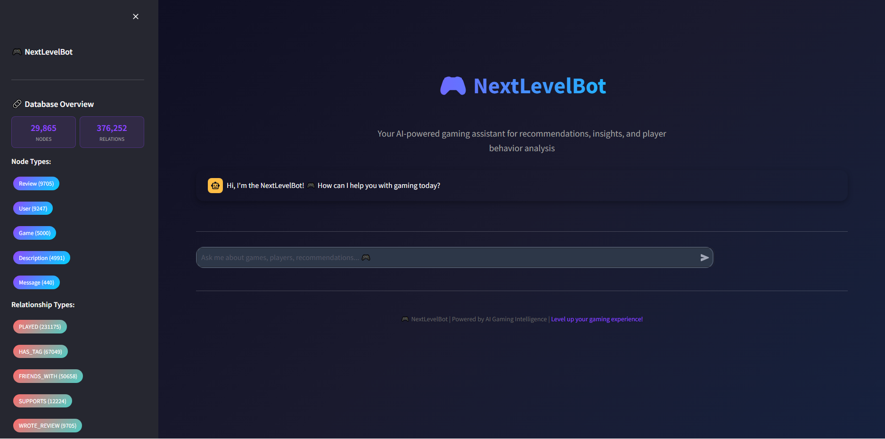
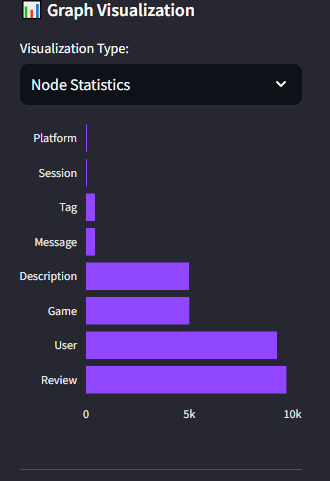
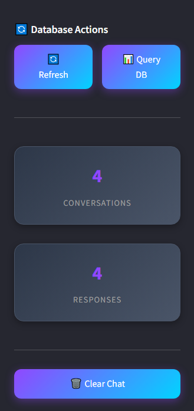
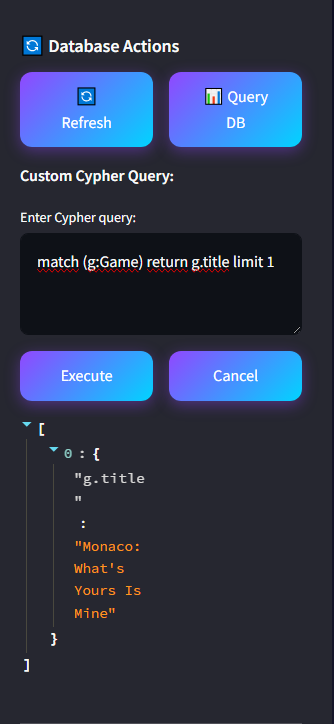
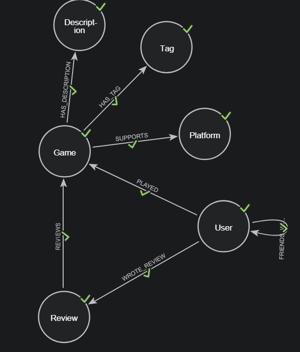
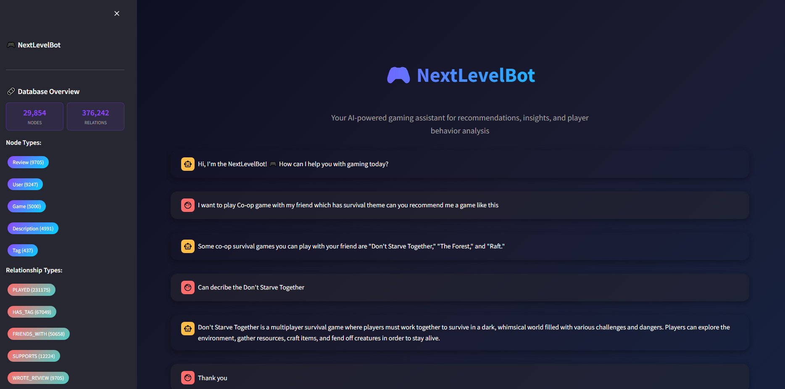
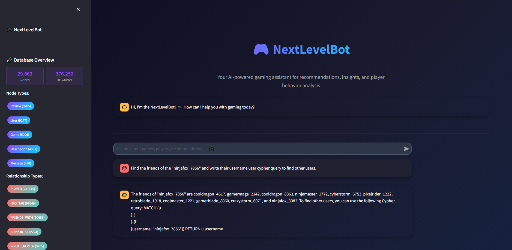

# 📘 NextLevelBot 

## 🎮 Project Overview 

NextLevelBot is a semantic and graph-based AI assistant designed to help
users explore video games, based on user behavior, game descriptions,
tags, platforms, and relationships among players.  
Built with Neo4j, Python, LangChain, OpenAI GPT-3.5, and Streamlit.

## ✨ Features 

- \- Natural language Q&A over game data (play history, friends, tags)

- \- Description-based semantic search via vector embeddings

- \- Personalized recommendations through graph exploration

- \- Visualization of game-user relationships

## ⚙ Technologies Used 

- Backend: Python, LangChain

- Database: Neo4j (Graph DB)

- Frontend: Streamlit

- Embedding: OpenAI text-embedding-ada-002

- LLM: OpenAI GPT-3.5 Turbo

## 📁 Dataset Overview 

- /data/

<!-- -->

- ├── games.csv

- ├── users.csv

- ├── recommendations.csv

- ├── tags.csv

- └── descriptions.csv

## 📂 Folder Structure 

- nextlevelbot/

<!-- -->

- ├── agent.py

- ├── bot.py

- ├── llm.py

- ├── graph.py

- ├── tools/

<!-- -->

- │ ├── cypher.py

- │ └── vector.py

<!-- -->

- └── utils.py

## 🔧 Installation & Run 

1.  1\. Clone Repository

- \- git clone \<repo-url\>

2.  2\. Install Requirements

- \- pip install -r requirements.txt

3.  3\. Set up secrets.toml file

- \- OPENAI_API_KEY=\...  
- \- NEO4J_URI=\...  
- \- NEO4J_USERNAME=\...  
- \- NEO4J_PASSWORD=\...

4.  4\. Run the App

- \- streamlit run bot.py

## Screenshoots

Interface

Sidebar - Graph Visualization

 

Sidebar - Database Actions

Sidebar - Database Query 

## 💬 Sample Queries 

• Who are the friends of \'gamer123\'?

• Recommend me an RPG game released after 2020

• What games has \'pixelmaster\' played the most?

• What platforms does \'Hades\' support?

## 🧠 Graph Data Model 

- Node Types:

<!-- -->

- \- Game

- \- User

- \- Tag

- \- Platform

- \- Description

- \- Review

<!-- -->

- Relationship Types:

<!-- -->

- \- (:User)-\[:PLAYED\]-\>(:Game)

- \- (:User)-\[:FRIENDS_WITH\]-\>(:User)

- \- (:Game)-\[:HAS_TAG\]-\>(:Tag)

- \- (:Game)-\[:SUPPORTS\]-\>(:Platform)

- \- (:Game)-\[:HAS_DESCRIPTION\]-\>(:Description)

- \- (:User)-\[:WROTE_REVIEW\]-\>(:Review)-\[:REVIEWS\]-\>(:Game)

## 🐛 Troubleshooting 

- \- Ensure secrets.toml is properly configured

- \- Use GPT-3.5 for local testing to reduce cost

- \- Run using Streamlit to maintain chat session state

## Showcase

Query Results

